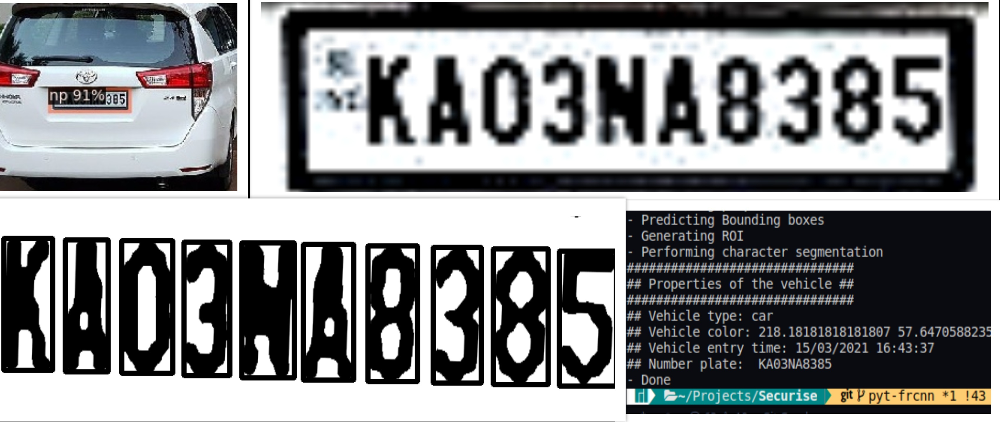
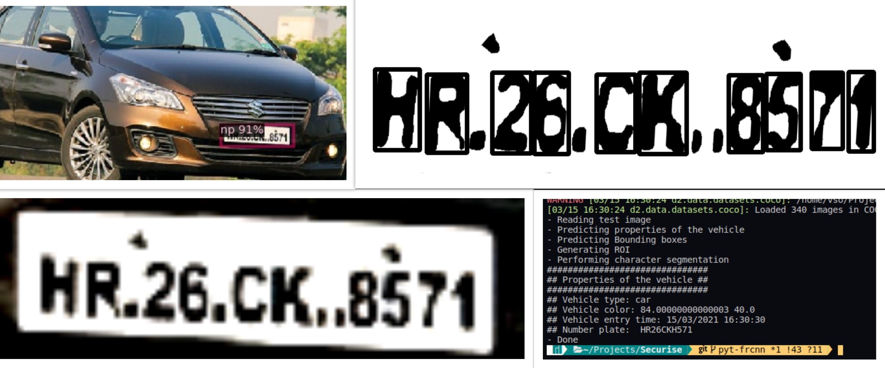

# Project Securise

Securise is an automatic number plate recognition system for the entrance of the campus of NIT Tirchy. The software uses computer vision to extract number plate details, vehicle properties like vehicle type, color, entry time, etc. for incoming vehicles and performs cross-checking when the vehicle exits the campus. This would significantly accelerate and improves entry security checks.

### **Demo Run:**

###### Successful output:

<pre>
</pre>

*Current work done:*

* Vehicle detection using **Yolo**
* Number plate detection using **FasterRCNN** *(Model available at: https://drive.google.com/drive/folders/1l-PkRb6YYTf4E36te2cScDGjCi-V5uQ4?usp=sharing. Move model to Results/)*
* Extracting dominant color present on the extracted car
* Character segmentation using **OpenCV** to extract license plate characters
* **PyTesseract** 4.0 to detect the characters and output it.
* Website to accept input image and display the output.
* (*Pending*) This Model has to be retrained in future so as to improve Indian Vehicle Detection Accuracy and to add indegenious vehicles.

*For training the FasterRCNN model:*

- Dataset: https://drive.google.com/drive/folders/1s-8IqlRPaawEEkk67yKc-l2SWr9wVPro?usp=sharing
- Move dataset dir to Dataset
- If you have an NVIDIA gpu, install CUDA and CuDNN for gpu acceleration.

*For running the program:*

- The main.py File in Lib/Detection is the Detection Model with pretrained Yolo weights.
- Download the yolov3.weights from here : https://pjreddie.com/media/files/yolov3.weights
- Run <code>python Lib/main.py</code> to start the program.

Currently the vehicle color, type, time of entry, number plate detection and character segmentation are obtained from the image fed to the program.

###### Failed Ouput:

<pre>
</pre>

In most of the cases, pytesseract is failing to detect due to the variance in the noise that's creeps into the numberplates or because of stylised fonts.

##### Problems faced/Improvements needed:

1. Substitute for PyTesseract to recognise the characters
2.
